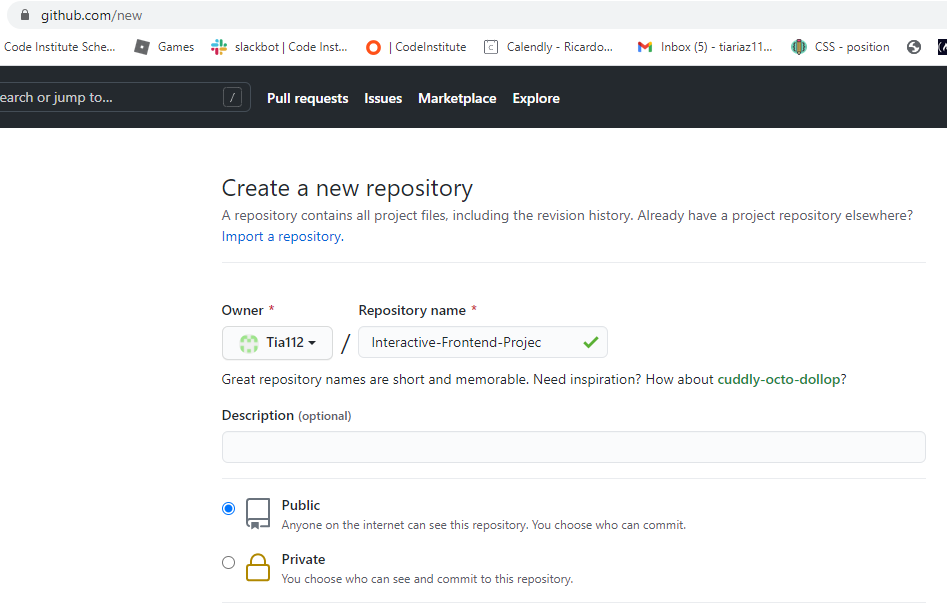
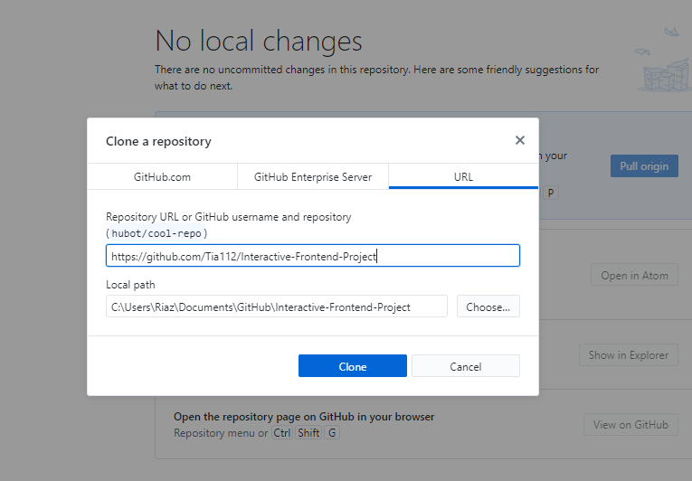
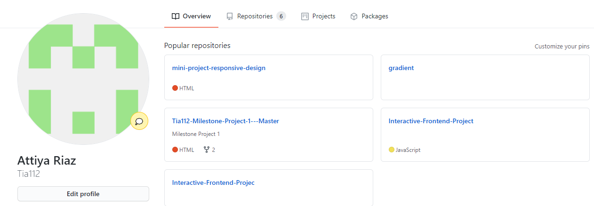
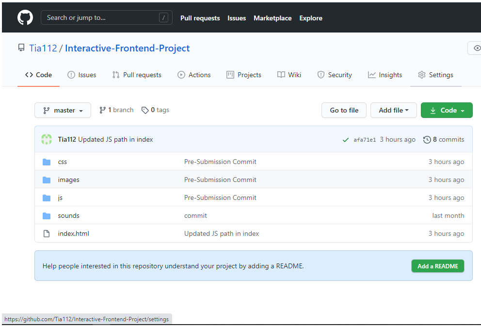
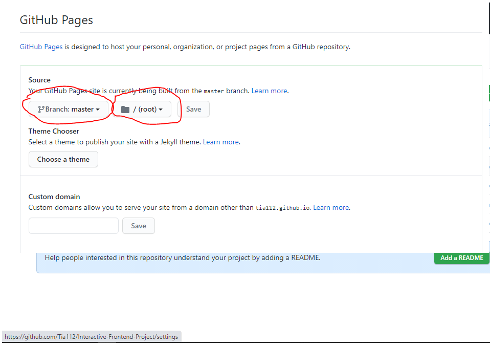
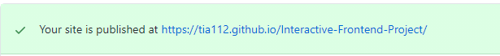

**Interactive Frontend Development Milestone Project**

Sounds of the Jungle is a website aimed at young children that are still
learning to read and associate sounds to Animals. The site was designed to make
it fun and interactive for the children.

**UX Design**

I used the 5 planes of UX design to help with structure of my site, these have
been identified below:

**Strategy**

The approach in the design of this site is based approach giving the user an
immersive experience. In that case, I have found that designing a site where the
target audience is children, would allow me to fully focus on the interaction –
as they would be better at testing the interactivity in a simple, yet functional
manner.

**Scope**

The website is created to empower children, make them smarter and keep them
engaged. I did this by incorporating bright colours and images, and make it look
playful. This would ensure children wanting to return to the site because of its
attractive and fun aspects and parents being happy with the learning content for
the age group targeted.

**Structure**

Features and Functionality

Research shows that under 7 year olds use a variety of devices to play games.
From the largest to the smallest screens, and for the smallest hands, I ensured
to make my site responsive and easy to navigate.

The site has one main page with a set of buttons with images and sounds attached
to them. This is carried out when the user is prompted to press a highlighted
key on the keyboard or touch on a touchscreen like an ipad or phone. This has
been achieved through simple JS functions.

There is also an option to click on the image itself which will display a modal
containing fun facts for the selected animal. This allows older children to be
included in the target audience, at the same time for parents to read the
selected facts to younger children. The modal itself is a single modal where
data has been stored in an array – data is passed to the modal using a simple
function thereby reducing code, and creating content dynamically.

Furthermore, to fully immerse the user, I have also made use of the sidenav
functionality to incorporate a selected Live stream from South Africa. This is a
24x7 stream which brings dynamic content to the site at any time. The live
stream is triggered using a small SVG TV icon which opens the sidenav – a simple
X allows the user to close sidenav with minimal effort. The sidenav itself was
give n a transparent look at just the right amount for a better viewing
experience.

Finally, a major addition to the site was the use of API integration. Based on
the theme itself, I was able to find a public API by National Geographic. The
API pulls or fetches Photos of the Day or various articles depending on what is
required. For my site, I decided to use this functionality to pull 2 photos
which are updated daily. The author (Cris Boarna) provided an API Key, User and
URL which I was able to implement using a simple AJAX fetch command, and, with a
lot of trial and error, was able to display the content into a DIV.

**Surface**

The colour choices used are to make children happy and get the child drawn into
the site. Colours make a big impression on young minds.

The main theme of this website is animals. Nature is an element that children
relate to and animals are a huge part of what stimulates them. Therefor the use
of animal images are used to continue the theme of the game both real and
animated.

The typography used was simple and clear for children to recognise letters and
read if they are able to.

The use of *rems* was used instead of pixels (px) to allow flexibility to adjust
any sizes so they are more responsive.

**Skeleton**

**Wireframes were drawn** in mobile, desktop and larger displays (5k+). This
helped to organise the content visually.

Wireframes are located here:

<https://github.com/Tia112/Tia112-Milestone-Project-1---Master/tree/master/wireframes>

**Technologies Used**

\- HTML

\- CSS

\- Javascript

\- Bootstrap

\- API integration with AJAX

**User Stories**

Child aged 2-5

-   Laughing at the images. Excited by the notion of pressing the key and
    hearing the sound of the animal. Was able to identify the animal from the
    picture and the sound. Parents also read out the name of the animal and
    showed her the picture of the day.

Child aged 6-9

-   Loved the animals and bright colours. Enjoyed watching the live feed and
    hearing the animal sounds. Enjoyed pressing keys to hear the sounds. Wants
    to come back and play again.

Child aged 10+

-   Also loved pressing the keys to hear the sounds. Enjoyed pressing key for
    the modal to pop up and read the fun facts to the parent. Loved the live
    feed and the pictures of the day. Wants to come back to the site again the
    following day.

**Testing**

| **Test Description**                               | **Expected Outcome**                                                             | **Actual Outcome**                                                    | **Re-Test** |
|----------------------------------------------------|----------------------------------------------------------------------------------|-----------------------------------------------------------------------|-------------|
| Testing the sound of the image when key is pressed | The animal sound should come when the first letter of the animal name is pressed | Passed                                                                | N/A         |
| Modal                                              | Press on the actual image for the modal to appear                                | Passed                                                                | Passed      |
| Hover states                                       | Hover states colour of the prime keys should change to another bright colour     | Fail Change to a bright colour. Stayed white                          | Passed      |
| Navbar on left                                     | Navbar should slide out displaying the livestream video                          | Passed                                                                | Passed      |
| Navbar on right                                    | Navbar should slide out pulling the picture from API Source                      | Failed – content not appearing, as planned, adjusted code             | Passed      |
| Responsiveness in mobile view                      | Navabars working and sliding out to size Font size should be fine                | Failed -Changed the width of the navbar - had to change the font size | Pass        |
| Responsiveness in 5k view                          | Font size to be proportionate                                                    | Failed                                                                | Pass        |

-   Changed the font-size

**Code Validation**

CSS was validated using the W3C CSS Validation Service
(<https://jigsaw.w3.org/css-validator/>)

HTML was validated using the W3C Markup Validation Service
(<https://validator.w3.org/>)

Javascript was validated using
https://www.freeformatter.com/javascript-beautifier.html

**Deployment**

Prior to deploying the site, the following steps must be taken to incorporate
the code into the repo:

1.  Create local workspace on PC. Log into Github account and create new
    repository:

1.  Link newly created repo to local workspace using Github repo URL and Github
    desktop:

This is has now created a channel between remote and local repos for staging,
push and commits. Visual Studio Code or Atom can be used to login to the
selected Github repo and facilitate this function during the development
process. The repo is located here:

<https://github.com/Tia112/Interactive-Frontend-Project>

To deploy the site upon completion of the code, the following steps need to be
taken:

1.  Login to github and select required repo:

1.  Select Settings:

    

2.  Select Settings and scroll down to the GitHub Pages section:

1.  Select the Source as the **Branch:master and /(root)** as the specified
    location. Click **Save**.

2.  If successful, the page will refresh with the following confirmation:

The page can now be viewed from any device from the following URL:

<https://tia112.github.io/Interactive-Frontend-Project/>

**Conclusion**

In the future, I would like to have included more information like captions for
the dynamic content being retrieved by the api. Also, a fuller catalogue of
animals and more media for each one like video clips, wiki articles, and even
games.

**References**

**Images**

https://all-free-download.com/

\-pixabay.com

**Fonts**

Fonts.google.com

**Code**

W3Schools.com

Getbootstrap.com (used and amended as a guide for modal and buttons and
navbars).

<https://github.com/crisboarna/national-geographic-api> (Nat Geo API)

All the information on the site is written by myself.

#### **Acknowledgements**

A huge Thankyou to my mentor Brian Macharia for all his time and efforts to
guide me through this project at times of crisis.

A special Thankyou to Lucy Rush, (Studentcare) \@ CodeInstitute who has been
supportive all throughout.

**Disclaimer**

This site and its contents were for educational purposes only.
